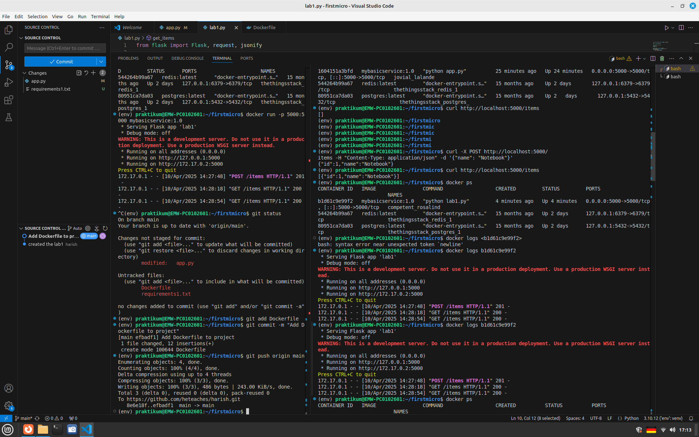
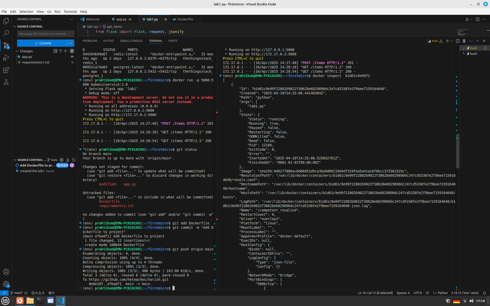
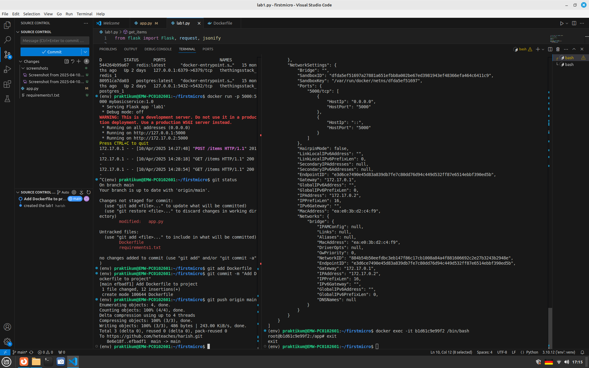

#Screenshots

The docker logs command which shows the CRUD operations done using the container

The docker inspect command which showed ip address,mac address and hostnames

The below shows opening bash shell within container
